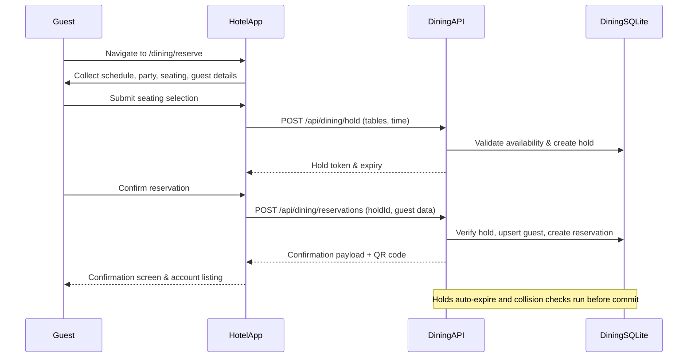

# GPT-Codex-Hotel

Aurora Nexus Skyhaven is an end-to-end Express.js experience showcasing a futuristic hotel. The project includes multi-step bookings, amenities with time-slot reservations, mocked payments, a printable invoice, an authenticated dashboard, and real-time chat powered by Socket.IO.

## Features

- **Room catalogue** with rich specifications, enhancements, and comparison table.
- **Booking wizard** (dates → room → guests/add-ons → review → payment → confirmation) with capacity validation and tax/fee calculations.
- **Amenities hub** with detail pages and reservation workflow that respects capacity.
- **Mock payment flow** (Luhn validation, capture, invoices, webhook endpoint, admin refund).
- **Guest dashboard** showing bookings, amenity reservations, profile/security management.
- **Dining integration** with shared authentication, real-time seat selection, and account management.
- **Live chat** for lobby, stay-specific rooms, and direct messages. Presence, typing indicators, rate limiting, profanity filtering, and persistence are included.
- **Admin control deck** to adjust inventory, review bookings/payments, and handle refunds.
- **SQLite persistence** with a dedicated seed script and session storage.

## Getting Started

1. Install dependencies and seed the shared SQLite database used by both the hotel and dining experiences:

```bash
npm install
npm run seed          # resets and seeds all hotel + dining data
```

2. Start the hotel shell and the dining API in separate terminals:

```bash
# Terminal A – hotel experience (Express + EJS)
npm run hotel:dev

# Terminal B – dining API (Node/TypeScript/Socket.IO)
npm run dev
```

3. Visit `http://localhost:3000` for the hotel site. The dining experience lives at `/dining` and shares the same session token.

Seeded credentials (password `skyhaven123`):

- `astra@skyhaven.test` (admin)
- `kael@skyhaven.test` (admin)
- `nova@guest.test`
- `juno@guest.test`
- `mira@guest.test`

> **Tip:** When developing locally over HTTP set `SESSION_TOKEN_SECURE=false` so the shared `session_token` cookie can be issued without TLS.

### Required environment variables

| Variable | Purpose | Notes |
| --- | --- | --- |
| `DATABASE_URL` | (Legacy) Connection string for external dining database | No longer required; dining now uses the local SQLite store seeded via `npm run seed`. |
| `HOTEL_JWT_PRIVATE_KEY` or `HOTEL_JWT_SECRET` | Signing material for the `session_token` JWT shared with the dining API | Use an RSA private key (PEM) for RS256 or a symmetric secret for HS256. |
| `HOTEL_JWT_PUBLIC_KEY` or `HOTEL_JWT_SECRET` | Verification key exposed to the dining API | Must match the signing material above. |
| `SESSION_COOKIE_DOMAIN` | (Optional) Shared cookie domain for multi-host deployments | Example: `.skyhaven.test`. |
| `SESSION_COOKIE_SECURE` | Controls the Express session cookie security flag | Defaults to `true` in production. |
| `SESSION_TOKEN_SECURE` | Controls the JWT cookie security flag | Defaults to `true`; set to `false` for local HTTP development only. |
| `SOCKET_ORIGIN` / `SOCKET_ORIGINS` | Additional websocket origins for CSP | Comma-separated list supported. |

## Scripts

- `npm run hotel:dev` – hotel Express application with hot reload.
- `npm run dev` – start the dining API with tsx + nodemon.
- `npm run seed` – reset and seed the SQLite database with hotel, chat, and dining demo data.
- `npm test` – run Jest tests covering booking creation, payment capture, and chat persistence.
- `npm run test:e2e` – execute Cypress dining integration tests (requires both servers running).
- `npm run cy:open` / `npm run cy:run` – open or headlessly run the Cypress test suite.

## Testing Notes

Tests automatically reseed the database before each case. The chat tests exercise the persistence layer, while booking and payment tests validate totals and captured state. For Cypress, start the hotel (`npm run hotel:dev`) and dining (`npm run dev`) servers and, if developing over HTTP, export `SESSION_TOKEN_SECURE=false` so the shared cookie can be issued locally:

```bash
SESSION_TOKEN_SECURE=false npm run test:e2e
```

## Dining reservation lifecycle



## Real-time Chat Tips

- Visit `/chat` while logged in. Lobby is joined automatically, stay rooms are derived from active bookings, and DMs can be initiated via the sidebar.
- Presence badges turn cyan when contacts are online.
- Typing indicators appear at the top of the chat window.

## Mock Payment Walkthrough

1. Create a booking through `/book` and review the totals.
2. Visit `/pay/:bookingId`, use any future expiry and CVC with card number `4242 4242 4242 4242`.
3. Upon submission the booking is marked Paid, a receipt is generated, and `/pay/:id/confirmation` links to the printable invoice.
4. Admins can trigger refunds from `/admin` which create reversal records.

Enjoy exploring the future of hospitality!
